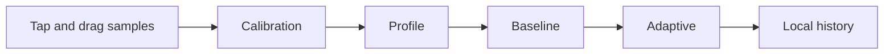

# SteadyTap

An iPhone and iPad touch-practice app that measures tap and drag samples, builds an adaptive interaction profile, and compares baseline and adapted practice.

**Native SwiftUI · accessible interaction · local persistence**

[Preview](https://steadytap.pages.dev) · [Verification and design](docs/VERIFICATION.md) · [CI](https://github.com/KIM3310/SteadyTap/actions) · [Detailed setup](REFERENCE.md)



## Inspect the implementation

| Source | What it demonstrates |
|---|---|
| [Core/CalibrationEngine.swift](Core/CalibrationEngine.swift) | Sample validation, calibration metrics and bounded adaptive settings |
| [Core/PersistenceStore.swift](Core/PersistenceStore.swift) | Local history and preference persistence |
| [Core/DistributionPolicy.swift](Core/DistributionPolicy.swift) | Local-only release boundary |
| [UITests/CalibrationFlowTests.swift](UITests/CalibrationFlowTests.swift) | Native tap/drag gesture flow through review and into practice |
| [.github/workflows/app-store-readiness.yml](.github/workflows/app-store-readiness.yml) | Unsigned iOS release build, simulator launch and UI-flow evidence |

## Run it

```sh
./scripts/verify_cli.sh
make verify-app-store
make verify-backend
# On a Mac with Xcode:
swift test
make generate-xcode-project
```

## Evidence

The actual shared Swift core passes the local CLI regression suite; release metadata/privacy checks and 12 backend tests pass. Native iOS release compilation and simulator gesture tests run in the linked GitHub Actions workflow; inspect its result and attached evidence for the exact revision.

## Scope

No physical iPhone/iPad test or App Store publication is claimed. Calibration confidence is a coverage/consistency heuristic, not a clinical measure or validated health outcome. App Store Release remains on-device; the FastAPI backend is a separate debug sandbox.

## Further reading

[Architecture](docs/cloud-ai-architecture.md) · [Architecture manifest](docs/architecture/blueprint.json) · [Architecture validator](scripts/validate_architecture_blueprint.py) · [Original reference](REFERENCE.md)
